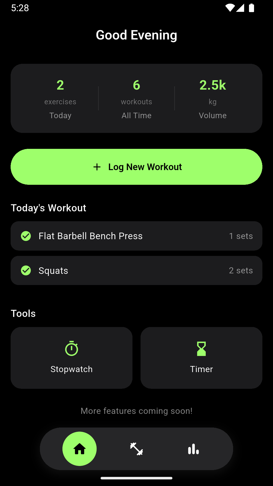
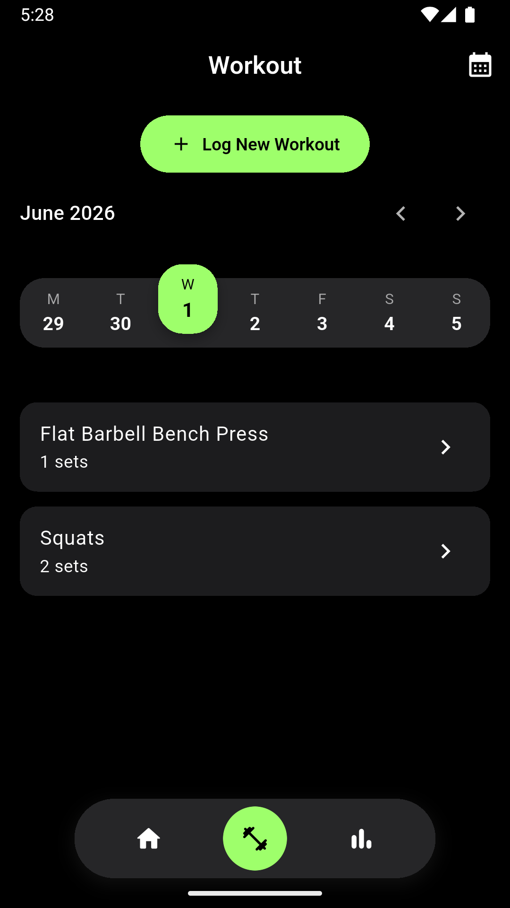
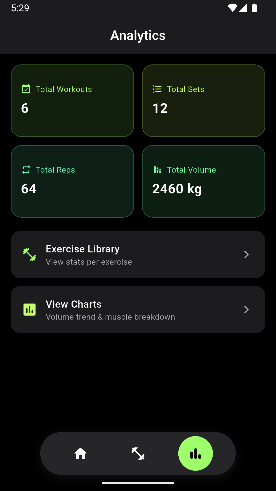
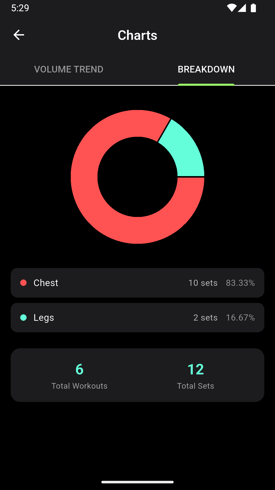

# NexRep 🏋️

A cross-platform fitness tracking app built with Flutter, designed to log workouts, track progress over time, and visualize training data through interactive charts — all stored locally on-device with no backend required.


## Overview

NexRep lets users log workouts by muscle group, track sets/reps/weight per exercise, and view detailed analytics including estimated 1RM (via the Epley formula), volume trends over time, and muscle-group training distribution — similar in spirit to apps like Hevy or Strong, built from scratch as a personal project.

## Features

- **Workout Logging** — Browse exercises organized by muscle group (Chest, Back, Legs, Shoulders, Biceps, Triceps, Forearms), log sets with reps and weight, and edit/delete past entries
- **Calendar-based History** — Week-strip and full calendar view to browse workouts logged on any past date
- **Per-Exercise Analytics** — Interactive line charts for Estimated 1RM, Max Weight, Max Reps, Volume, and Total Reps per session, with a graph-type picker
- **Overall Analytics Dashboard** — Aggregate stats (total workouts, sets, reps, volume), a volume trend chart with time-range filters (1m/3m/6m/1y/all), and a muscle-group breakdown donut chart with set distribution
- **Built-in Stopwatch & Timer** — For tracking rest periods or workout duration, persists in the background across screens via a mini session bar
- **Personal Record Detection** — Automatically flags a set as a PR when it matches the best recorded reps at that weight
- **Local Persistence** — All data stored on-device using `shared_preferences`; no account or internet connection required

## Tech Stack

| Category | Tools |
|---|---|
| Framework | Flutter (Dart) |
| State Management | Custom `ChangeNotifier`-based providers (`WorkoutManager`, `TimerSession`, `StopwatchSession`) |
| Charts | [`fl_chart`](https://pub.dev/packages/fl_chart) — line charts and pie/donut charts |
| Local Storage | `shared_preferences` (JSON-serialized workout history) |
| CI/CD | GitHub Actions — automated APK builds on push |

## Architecture

lib/
├── models/          # Data models (Workout, ExerciseEntry, WorkoutSet)
├── providers/        # State management (WorkoutManager singleton)
├── screens/          # UI screens (Home, Workout, Analytics, Charts, Exercise Log, etc.)
├── theme/             # Centralized color palette and ThemeData
├── exerciselist.dart # Static exercise database grouped by muscle group
└── main.dart

The app follows a lightweight provider pattern rather than a heavier state management library (Bloc/Riverpod) — `WorkoutManager` is a singleton `ChangeNotifier`-style class that owns all workout data, persists to `SharedPreferences` as JSON, and exposes aggregation methods (`totalVolume`, `getVolumeTrend()`, `getSetsByMuscleGroup()`, etc.) consumed directly by the analytics screens.

## Screenshots

| Home | Workout Log | Analytics | Charts |
|---|---|---|---|
|  |  |  |  |

## Getting Started

### Prerequisites
- [Flutter SDK](https://docs.flutter.dev/get-started/install) (3.x or later)
- Android Studio or VS Code with the Flutter extension
- An Android device or emulator

### Setup

```bash
git clone https://github.com/adiKr07/NexRep.git
cd NexRep
flutter pub get
flutter run
```

### Building a release APK

```bash
flutter build apk --release
```

The output APK will be at `build/app/outputs/flutter-apk/app-release.apk`.

### Automated builds

This repo includes a GitHub Actions workflow (`.github/workflows/build.yml`) that automatically builds a release APK on every push to `main`. The built APK can be downloaded from the **Actions** tab under the corresponding workflow run's artifacts.

## Key Implementation Details

- **Epley Formula for 1RM Estimation**: `weight × (1 + reps / 30)`, used to estimate one-rep max from higher-rep sets
- **Custom Expansion Tiles**: Muscle group lists use hand-built `AnimatedCrossFade` expansion tiles rather than Flutter's default `ExpansionPanelList`, for full control over theming
- **Session Persistence Across Navigation**: The stopwatch and timer use global singleton state objects so they keep running correctly even as the user navigates away and back


## License

This project is for personal/portfolio use. Feel free to fork and adapt.
